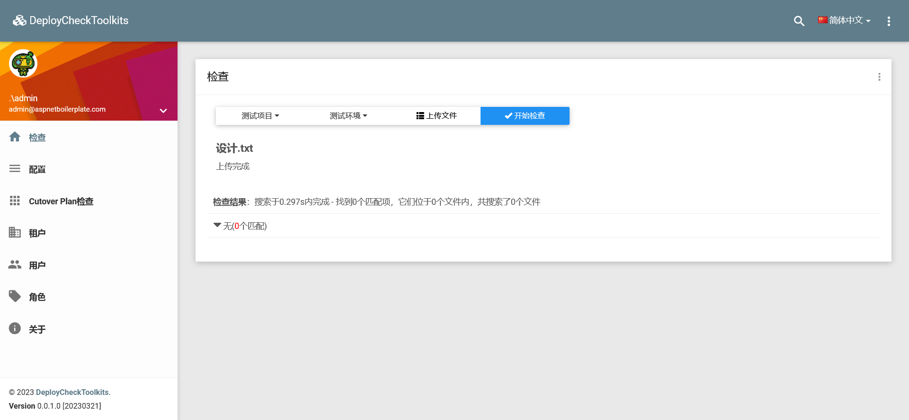
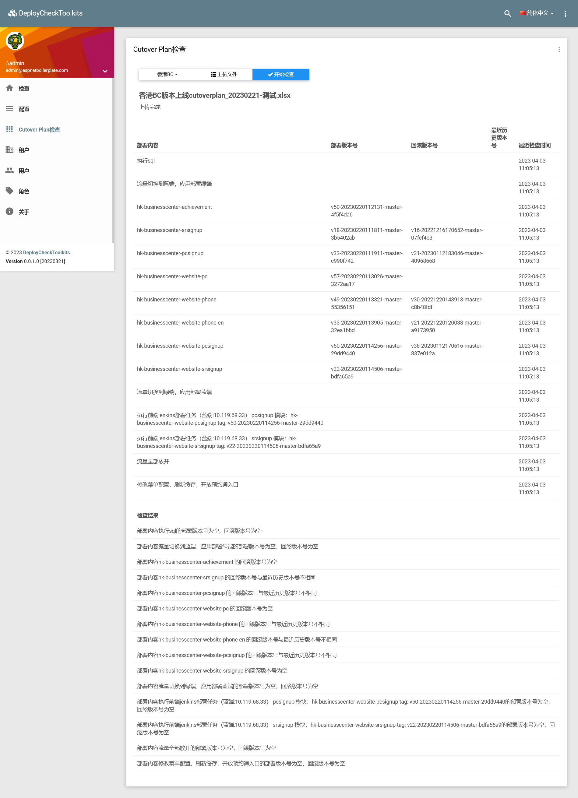
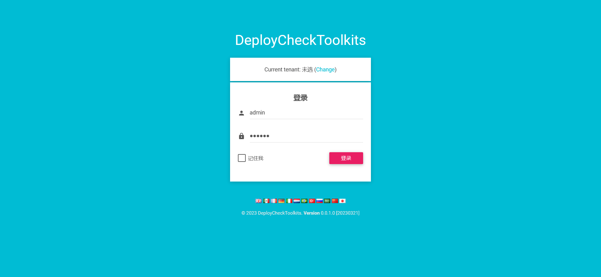

# Important

开发环境：Visual Studio 2019 + .NET Frameworks 4.8

# Introduction

部署：IIS (.NET Frameworks 4.8) + 安装ASP.NET Core 运行时 2.2.8（建议安装托管捆绑包[Hosting Bundle](https://dotnet.microsoft.com/zh-cn/download/dotnet/thank-you/runtime-aspnetcore-3.1.32-windows-hosting-bundle-installer)）

增加文件ProgramStudio.DeployCheckToolkits.Web.Mvc.runtimeconfig.json

{
 "runtimeOptions": {
    "framework": {
      "name": "Microsoft.AspNetCore.App",
      "version": "2.2.8"
    }
 }
}

ApplcationPool配置权限

web.config

设置节点aspNetCore的processPath=".\ProgramStudio.DeployCheckToolkits.Web.Mvc.exe"
<aspNetCore processPath=".\ProgramStudio.DeployCheckToolkits.Web.Mvc.exe" arguments="" stdoutLogEnabled="false" stdoutLogFile=".\logs\stdout" forwardWindowsAuthToken="false">

# Other

无

# Screenshots

#### 部署包检查

#### Cutover Plan检查

#### Login Page

# Documentation

无

# License

